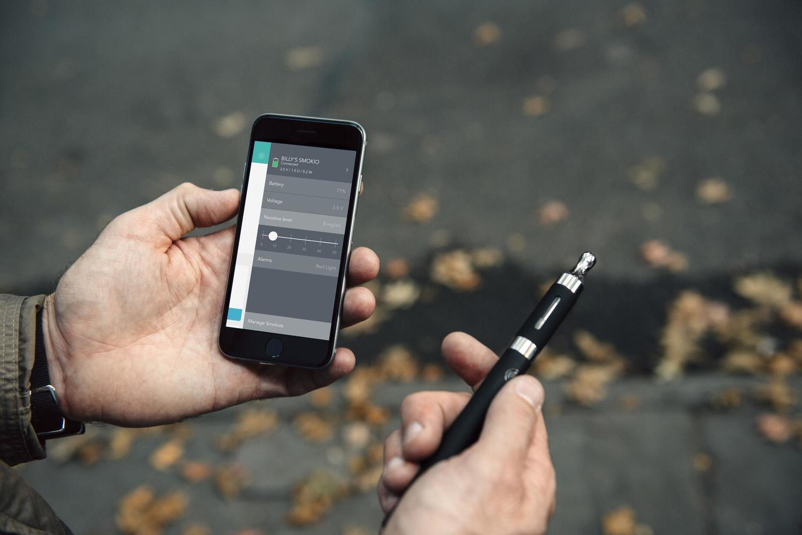
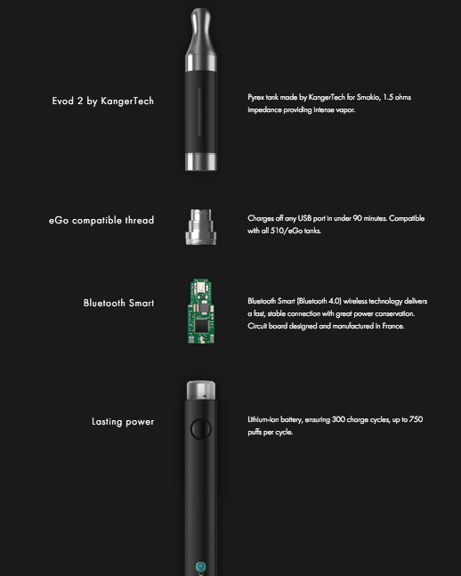
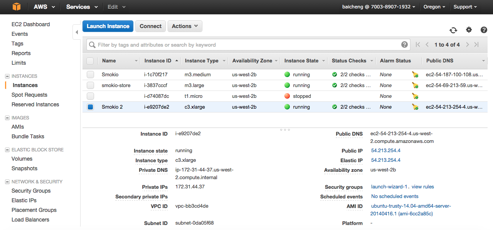
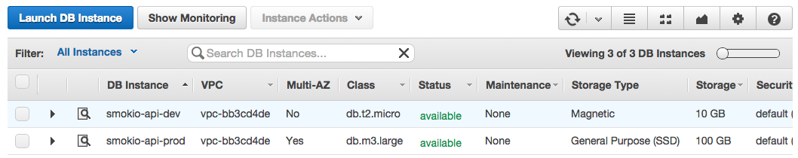
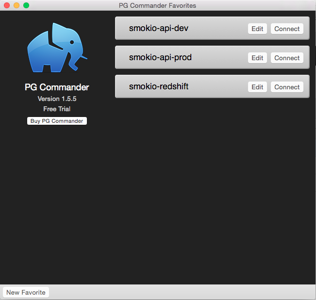
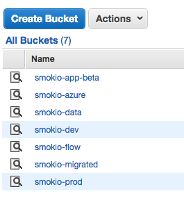
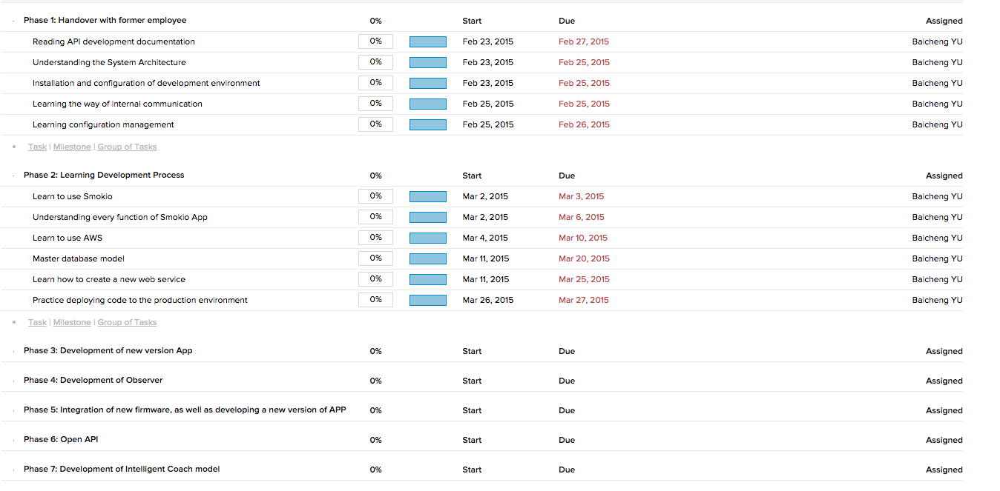

## 1. Presentation of enterprise

### 1.1 About enterprise

Smokio is a French company that develops and sells connected electronic cigarettes and innovative apps. It was founded in August 2013 in Paris, France. 

 *Figure 1 - http://www.smokio.com/*

The idea of our product came from our founder. Once as a heavy smoker, he konws well about smokers. He konws well the terrible harm that smoking brings to our health, and the spending of economy.

We want to help people to quit smoking, live a better and smarter life by brining technology to everyday life.

### 1.2 Organisation

Steve Anavi: President

Alexandre: CEO

Benjamin Prieur: Lead Developer iOS

Ivan Fernando Soriano: Android Developer

Safia Boudia: Operations Manager

### 1.3 Product

#### Overall

We spent 6 months working on the hardware and software to create the first smart and connected vaporizer.

 *Figure 2 - Overall: Smokio and Smokio App*

#### Hardware

Unlike basic vaporizers, Smokio lets you monitor your real time intake by measuring number of puffs and nicotine levels. Smokio is a smart, but also beautiful vaporizer. The inside of Smokio, there is a circuit board designed to control the output power of vaporizer, collect user activities and communicate with our mobile application by using Bluetooth 4.0.

 *Figure 3 - Smokio: Smart vaporizer*

#### Software

**Mobile application**

The Smokio app tracks your everyday vaping activity. It's full of quantified features to help you moniter your activity and improve your vaping experience.

* Track your usage
> 
 It shows how well you are doing thanks to insightful reports and customized notifications. You can then set up your milestones at your own pace.
* Measure the benefits.
> 
 To keep you motivated, Smokio keeps track of the financial savings you make every day! For the first time, you're able to directly reap benefits of your efforts.
* Assemble your team.
> 
 You can interact with your friends, compare stats and move together as a team. The Smokio app taps Facebook and Google+.
* Remote control
> 
 The Smokio app allows to control your Smokio device directly from your smartphone: check the level of battery, set puff limits or adjust the voltage for more/less intense puffs.
* Connect Smokio with your activity trackers
> 
 You can compare your Smokio stats with your activity such as the number of calories or the weight. The Smokio app allows you to connect external apps (Jawbone, Withings or Fitbit) to retrieve your data.

**Observer application**

Observer is a SaaS(Software as a service) application who permits our users to share their data with the professional researchers who might find relevant to access user's data. It is currently in beta version.

Observer has basic function of a SaaS application, such as Subscription, integration of the third party payment platform, access control, authentication, etc.

### 1.4 Belief

We believe in building quality experiences for our customers through elegance and simplicity while maintaining high level of security and privacy. These principles form the cornerstone behind our work, and reinforces our belief that that the best technology makes you smarter, puts you in control, and gives you access to the information you need.

## 2. Expected contributions

According objectives defined in my intership contract, my expected contributions will include two aspects of technical and cooperation. On the technical side, I need to use my expertise to the company's product development. In terms of cooperation, I need to integrate myself into our internal development team, as well as external development teams to communicate, and thus advance the development of our product.

### 2.1 Technique

#### Web services:

* 
 With the new features to be added and improvements, on the server side, I need to design and implement some new APIs to collect data from multiple mobile platforms (currently iOS and Android), and in response to the request of Smokio App on the mobile terminals.
* 
 In the back end, in case of need to use a third-party API, I need to integrate them into our services, such as Stripe, Mandrill, SendWithUs, etc.
* 
 I need to develop our own Open API, share our data interface to third-party developers to enrich our platform product features.

#### Web application:

As we have concerned before, we are planning to create a SaaS web application, called Observer. For this web application, I need construct a high quality and well-designed web application who can be used to manage accounts, visual display of data users and interact with existing services.

#### Business intelligence

As the number of users increases, user data will become more and more, in order to fully exploit the value of these data. We need a platform to acquire and process historical data. By using data mining knowledge, find some meaningful patterns, and build some models.

* 
 Establish and improve a platform which is in charge of integration and near real-time analysis of historical data stream.
* 
 In order to provide the function of one-to-one coach, develop and integrate an intelligent model

#### System Management and Maintenance

* Deploy a new version of product to the server
* Fix system bugs
* Monitor and maintain the normal operation of the server

#### Test

* Before release of the new features, I need to participate in test.

### 2.2 Collaboration

#### Internal communication

##### Technique team

* 
 Provide reliable web service for Smokio mobile app, to meet the development requirements of mobile application, in a efficient way to communicate with our team.
* 
 If there is any disagreement, we consult together to determine a best solution.
* 
 Regularly reporting progress, with the agile development team management.
* 
 Regular working meetings to determine the development plan.

##### Custom support

When our customer support received technical feedback from users, forwarded it to the development team. I need without affecting the progress of the development, to assist other members of the development team, solve problems for users as soon as possible.

#### External communication

##### Third party plat-form

While using a third-party service platform, we would inevitably encounter some problems. May be some technology problems, it may be that we have not integrated their services in the right way.

Therefore, we need contact their technical support contact in time, to figure out the source of the problem and provide solutions. That will reduce our losses to a minimum.

##### China

Somkio are produced and assembled in China, and our application becomes availiable to many countries and regions, recently entering into the Chinese market.

* 
 I will be responsible for part of the Chinese translation of the document, as well as contact with Chinese suppliers and customers.
* 
 Smokio APP will be launched in some principle Android App Stores in China.

## 3. Bibliographic study

[1] Hartl, M. 2015. Ruby on Rails Tutorial: Learn Web Development with Rails (3nd ed.). Addison-Wesley Professional.

[2]Flanagan, D. and Matsumoto, Y. 2008. The Ruby programming language. O'Reilly.

[3]Stripe API Reference: 2015. https://stripe.com/docs/api. Accessed: 2015- 04- 25.

[4]Stripe Payments in Rails, Part 1 - Stripe Checkout: 2015. http://www.gotealeaf.com/blog/stripe-checkout. Accessed: 2015- 04- 25.

[5]Stripe Payments in Rails, Part 1 - Stripe Checkout: 2015. http://www.gotealeaf.com/blog/stripe-checkout. Accessed: 2015- 04- 25.

[6]What Is Amazon EC2? - Amazon Elastic Compute Cloud: 2015. http://docs.aws.amazon.com/AWSEC2/latest/UserGuide/concepts.html. Accessed: 2015- 04- 25.

[7]Getting started · Bootstrap: 2015. http://getbootstrap.com/getting-started/. Accessed: 2015- 05- 25.

[8]S.  Ruby, D.  Thomas and D.  Hansson, Agile web development with Rails 4, 4th ed. Pragmatic Bookshelf, 2013.

## 4. Technical solution

In this part, I will talk about our technical solution.

### 4.1 Hardware solution

#### 4.1.1 Amazon web services:

About hardware environment, we use **Amazon Web Service** who offers a broad set of global compute, storage, database, analytics, application, and deployment services that help organizations move faster, lower IT costs, and scale applications. Our application servers and database servers are deployed in amazon web services.

##### Application Server

we are currently using an **EC2**(Elastic Compute Cloud) instance of AWS. Our application server is running on this instance.

 *Figure 4 - EC2 Management Console*

**Type of instance**

Considering our normal and potential requirement, we chosed an c3.xlarge instance as our principle server, for a beginning startup, I think this instance can satisfy our requirement.

Physical specifications:

vCPU: 1
Memory(Gib): 7.5
SSD Storage(GB): 2 x 40

Software environment:
Operating system: Linux(Ubuntu-trusty-14.04-amd64-server)
System Architecture: AMD x86-64

##### Database

Amazon offers the relational database service as well. Amazon **RDS** (Relational Database Service) makes it easy to set up, operate, and scale a MySQL, Oracle, SQL Server, or PostgreSQL database in the cloud. It provides cost-efficient and resizable capacity while managing time-consuming database administration tasks.

We have created two database instances, one of them for our developement and test environment, and the other one for production environment.

 *Figure 5 - RDS Management Console*

For these two RDS instances, we choosed **postgres** as our database engine.
We can access our databases remotely, thanks to "**PG Commander**", a beautiful mac application who premits us to execute sql queries.

 *Figure 6 - Prostgres database GUI tool*

##### Storage

In general, we need to store two types of files. Firstly, all firmware files, when user tries to initialize a new smokio, they need download these firmware files stored by us. Secondly, we have some files generated by our users to be stored in our server. **Amazon Simple Storage Service** (S3) is a service can be used to store and retrieve any amount of data.

All files in S3 are organized in the way of **buckets**. Generally, we use mostly two buckets "smokio-dev" and "smokio-prod" for the storages of files in two environment.

 *Figure 7 - S3 buckets-1*

 *Figure 8 - S3 buckets-2*

#### 4.1.2 Smokio Device

Smokio is a microprocessor-controlled vaporizer. Its patented electronics captures all your vaping data such as puff duration and nicotine intakes, and sends it to your smartphone through Bluetooth Smart (or Bluetooth 4.0) without any additional efforts.

With microprocessor and bluetooth technique of Smokio, the acquisition of user usage data becomes possible.

#### 4.1.3 Mobile Terminal

We develop the mobile applications for mobile terminals which are used by our users. These terminals are in charge of receiving smokio's usage data, synchronization with our backend system by using our **web services**(APIs), providing users an interface to track their uses, configure their smokio, communicate with friends, etc.

### 4.2 Software solution

We proposed a solution based on Ruby and **"Ruby On Rails"** framework. As we all know, Rails as an agile web development framework has been approved its value by a lot of startups, even some big companies. We can reduce the cost of development, and improve the efficiency. It's an extremely ideal technique for a startup like Smokio.



 *Figure 9 - Ruby On Rails logo*

Without doubt, we choosed “Ruby On Rails” as our principle technique for comstructing web services and web application. 

#### 4.2.1 Web Service

##### Grape

[**Grape**](https://github.com/intridea/grape) is a REST-like API micro-framework for Ruby. It's designed to run on Rack or complement existing web application frameworks such as Rails and Sinatra by providing a simple DSL to easily develop RESTful APIs.



 *Figure 10 - Grape: gem to build RESTful API*

With the 3-layer model of Rails, we can design the common models who can be reused in both web services and web application. We can also use the **"ActiveRecord"** module of Rails to encapsulate database query operations.

##### grape-swagger

To understand the reason why we use "[**grape-swagger**](https://github.com/tim-vandecasteele/grape-swagger)" gem, I should explain two techniques firstly.

**Swagger** is a simple yet powerful representation of your RESTful API. It can offer an interface for our APIs which can help a consumer or other developers to understand and interact with the remote service with a minimal amount of implementation logic.

**Swagger UI** is a dependency-free collection of HTML, Javascript, and CSS assets that dynamically generate beautiful documentation and sandbox from a Swagger-compliant API.

The grape-swagger gem is able to provide an autogenerated documentation for your Grape API. The generated documentation is Swagger-compliant, meaning it can easily be discovered in Swagger UI.

So with all these tools, we can easily build our web services and provide an user-friendly interface to mobile developers in our team.



 *Figure 11 - Swagger: gem to generate API documentation*

#### 4.2.2 Observer application

**Observer** is a typical web application to be realised by "Ruby On Rails". Meanwhile, it's a typical SaaS plateform as well.

For the beginning, I will use my knowledge of **Software Requirements Analysis** to define our system specifications.

In the backend, we use **Ruby On Rails** to build our object model, business logic, REST-ful routes, html templates. We will follow Rails' **MVC pattern**. In model layer, we reuse the models with web services. In controller layer, we will implement all business logics we need, such like authentication, access control, subscription, third party payment, and so on.

In addition，we need to integrate third party services into our SaaS plateform, such as **Stripe**(payment plateform), **SendWithUs**(invoice generator). By using these exisiting services and framework, we will realize the fundamental functions of SaaS plateform.

### 4.3 Technical architecture

## 5 Planning

This chapter, I will introduce our development planning. We are a small and flexible team. Our schedule isn't always fix. We use the agile development methodology, like Scrum. We iterate very quickly.

### 5.1 Planned schedule

In gerenal, according to the objective of my intership. I separate my job into 7 phases. As described in figure 5-1.

Phase 2 and 3 have gone on parallelly, because during the development of a new version application, I will get familiar with our development process and methodology.

 *Figure 12 - Gantt Diagram: planned schedule*

### 5.2 Actual schedule

phase 1: Handover with former employee（23/02/2015 - 28/02/2015）

- Reading API development documentation
- Understanding the System Architecture
- Installation and configuration of development environment
- Learning the way of internal communication
- Learning configuration management

phase 2: Learning Development Process（02/03/2015 - 27/03/2015）

- Learn to use Smokio
- Understanding every function of Smokio App
- Learn to use AWS
- Master database model
- Learn how to create a new web service
- Practice deploying code to the production environment

phase 3: Development of new version App (05/03/2015 - 01/04/2015)

- Development of v8 version API
	- support of deep-linking
	- send push notification to mobile
	- notification for the recovery progress of health
	- deployment v8 into the production environment
	
- Fix bugs

- Observer: improvements of existing features
	- flash messages in the registration
	- Email notifications of approval）
	

Phase 4: Development of Observer(02/04/2015 - 20/05/2015)

- Development of SaaS fonctions
	- Requirement analysis of SaaS
	- Leans to use Stripe
	- Stripe integration
	- Implementations of SaaS
	
- In-app purchase
	- Create a new ec2 instance
	- Installation and Configuration of development environment 
	- Implement, deploy an e-commerce website(Spree)
	- Multi-currency support
	- Account-recurring support

Phase 5: Integration of new firmware, as well as developing a new version of APP (21/05/2015 - 12/06/2015)

- Development of v9 version API
	- add mode management for device
	- add temperature, power attributes for device
	
- Improvement of Observer
	- Referring Zendesk, improve the subscription process
	- Improved UI, and add dynamic Ajax effects
	

Phase 6: Open API (15/06/2015 - 03/07/2015)

Phase 7: Development of Intelligent Coach model (03/07/2015 - 21/08/2015)

 *Figure 13 - Gantt Diagram: actual schedule*
